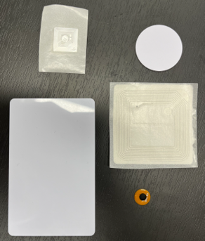
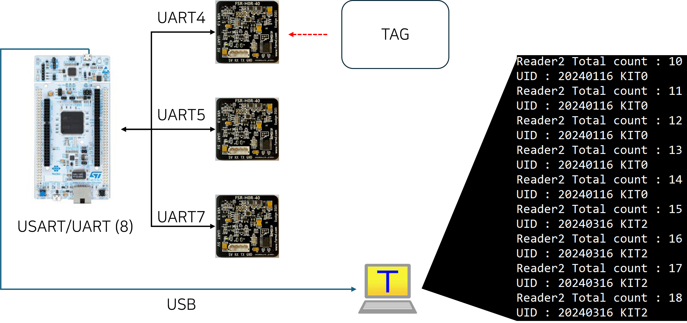
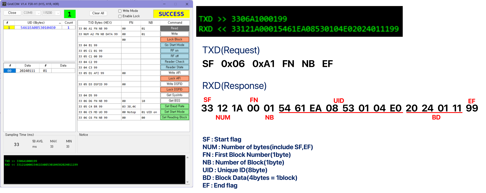

# 방사능 구호 물품 보관함 프로젝트
RFID태그, 리더를 이용하여 실시간으로 재고확인을 수행하고자 함.
## 협력업체
- 문수산업기술
- 울주군 (발주처)
- 키넷 (기구설계)
- UNIST (전장부)

**사용 장비**
```
FSR-H0R-40
STMF767ZI 보드
TAG (5종류)
```

**수행 방법**
- ST사 ST25RU3993-HPEV를 처음 사용하였으나 빈 냉장고 환경에서 완벽하게 모든 태그를 인식하지 못함
- FSR-H0R 리더기를 사용하여 STMF767ZI보드와 UART통신을 통해 개별로 인식되는 태그를 인식
  
- 리더기 제조사 프로그램을 사용하여 인식되는 TAG의 COUNT와 특정 TAG를 구분해냄
  

<!--</img><br/>-->
<!--</img><br/>-->


